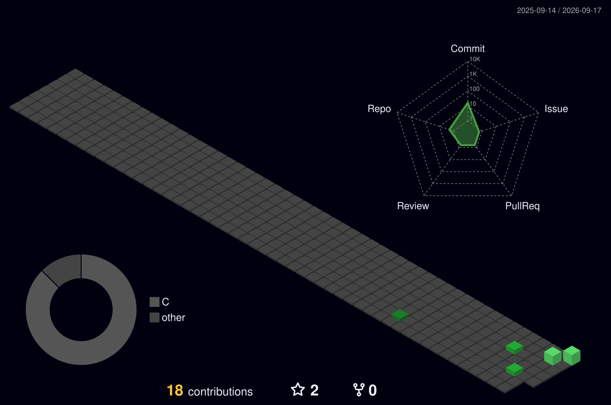

  ## print("Hello World!")

  ```java
public class Miguel {
  private String name = 'Miguel Santos';
  private Location location = new Location("Brazil", "Macaé", "RJ");
  private int age = 20;
}
```
 
  <div align="center">
    <br>
    &nbsp;&nbsp;
    &nbsp;&nbsp;
     &nbsp;&nbsp;
    &nbsp;&nbsp;
    &nbsp;&nbsp;
    
</div>
  <br>
 
 
 <!--- 

 <div style="display:inline_block">
    	
      
      
      
      
      
      
      
      
  </div>
  
  <hr>
  <div>
  <a href="https://www.instagram.com/miiguelssantos" target="_blank"></a>
  <a href="https://www.twitter.com/odevmiguel" target="_blank"></a>
  </div>
--->
    
   <div align="center">
   &nbsp;
   &nbsp;
  
</div>
  <br>
  
 

  


<!---
miiguellssantos/miiguellssantos is a ✨ special ✨ repository because its `README.md` (this file) appears on your GitHub profile.
You can click the Preview link to take a look at your changes.
--->
